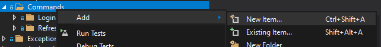
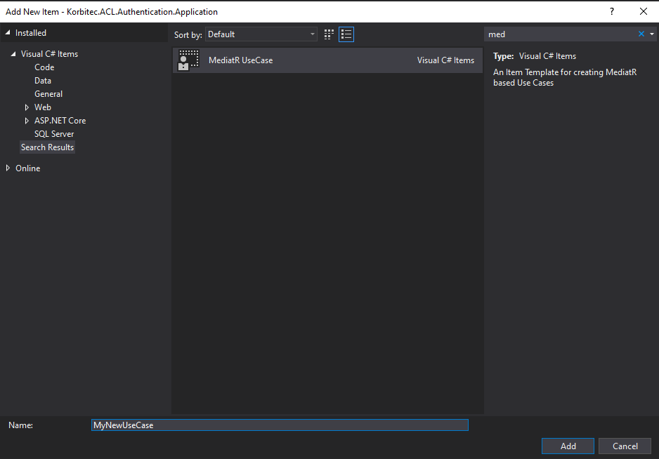
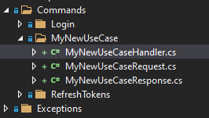

# MediatRUseCaseItemTemplate
A Visual Studio Item Template to automatically generate MediatR Request, Response and Handler classes.

## Usage

- Create new item on your `Query` or `Command` namespace

  
- Select the Item Template and rename the item with your Use Case name.

  
 - The `Handler` with the `Request` and `Response` objects are created.

